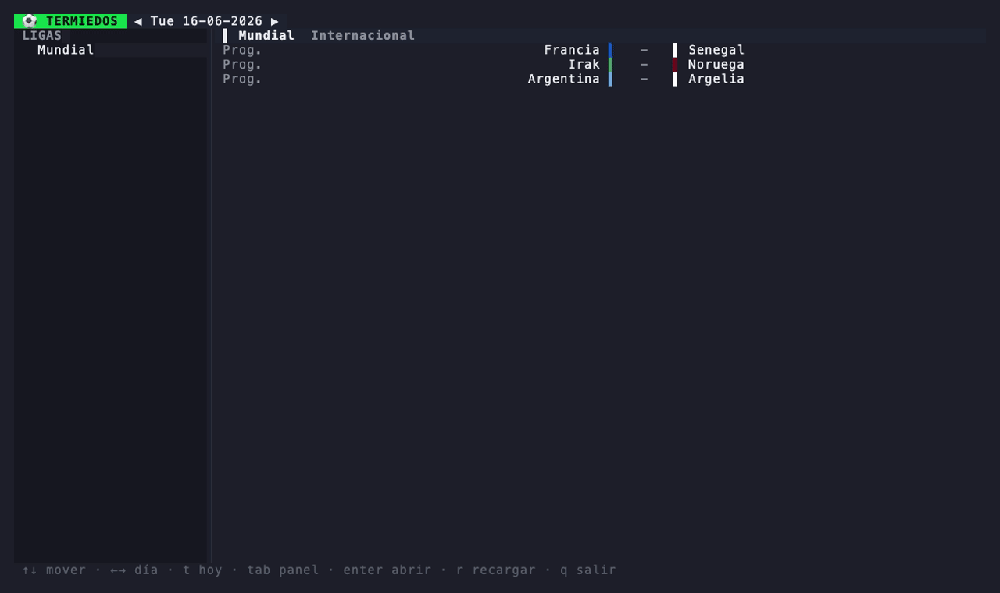

# termiedos

[](https://github.com/ianaya89/termiedos/actions/workflows/ci.yml)
[](https://github.com/ianaya89/termiedos/releases)

[](LICENSE)

`term` + `promiedos` — resultados de fútbol en la terminal: marcadores en vivo, tablas de
posiciones, fixtures y detalle de partido. Hecho con Go + [Bubble Tea](https://github.com/charmbracelet/bubbletea).



Toma los datos de la API no oficial de [promiedos.com.ar](https://www.promiedos.com.ar) y los
renderiza en una interfaz de terminal con tema oscuro, colores de equipo y auto-recarga de los
partidos en vivo. Sin configuración: un solo binario y listo.

**Características:** marcadores por fecha · tabla de posiciones con zonas de clasificación ·
fixture por liga · detalle de partido · barra lateral de ligas · auto-recarga en vivo (15 s) ·
navegación con teclado · binario único sin dependencias.

## Vistas

| Vista | Qué muestra |
| --- | --- |
| **Resultados** (inicio) | Partidos del día agrupados por liga: hora/estado, colores de equipo y marcador. Navegación de fechas y recarga en vivo. |
| **Posiciones** | Tabla de la liga con zonas de clasificación por color y soporte de grupos/fases. |
| **Fixture** | Listado completo de partidos por ronda de la liga seleccionada. |
| **Partido** | Marcador, estado, estadio/árbitro y canales de TV. |

## Instalación

| Plataforma | Recomendado |
| --- | --- |
| Linux | script de instalación o binario precompilado |
| macOS | Homebrew o script de instalación |
| Cualquiera (con Go) | desde el código fuente |

### Script de instalación (Linux / macOS)

Descarga el binario correcto para tu OS/arquitectura, verifica su checksum y lo instala:

```sh
curl -fsSL https://raw.githubusercontent.com/ianaya89/termiedos/main/install.sh | sh
```

Instala en `~/.local/bin` por defecto. Se puede sobreescribir con variables de entorno:

```sh
TERMIEDOS_INSTALL_DIR=/usr/local/bin TERMIEDOS_VERSION=v0.1.0 \
  sh -c "$(curl -fsSL https://raw.githubusercontent.com/ianaya89/termiedos/main/install.sh)"
```

### Homebrew (macOS)

```sh
brew install ianaya89/tap/termiedos
```

> El cask de Homebrew es solo para macOS. En Linux usá el script de instalación o un binario precompilado.

### Binario precompilado

Bajá el tarball para tu OS/arquitectura desde la [página de releases](https://github.com/ianaya89/termiedos/releases) y:

```sh
tar -xzf termiedos_*_linux_amd64.tar.gz
install -m 0755 termiedos ~/.local/bin/termiedos
```

### Desde el código fuente (requiere Go 1.26+)

```sh
git clone https://github.com/ianaya89/termiedos ~/termiedos
cd ~/termiedos
make install          # compila con info de versión en ~/.local/bin/termiedos
# o: go build -o ~/.local/bin/termiedos .
```

Asegurate de tener `~/.local/bin` en tu `PATH` (o usá `PREFIX=/usr/local make install`).

> Si tu toolchain de Go no puede llegar a la base de datos de checksums (sandbox/offline),
> prefijá los builds con `GOSUMDB=off`.

## Uso

```sh
termiedos            # abre la pantalla de resultados de hoy
termiedos --version  # muestra la versión
termiedos --help     # ayuda y referencia de teclas
```

### Teclas

| Tecla | Acción |
| --- | --- |
| `↑ ↓` / `k j` | Mover la selección |
| `← →` / `h l` | Día anterior / siguiente (resultados) · cambiar de ronda (fixture) |
| `t` | Volver a hoy |
| `tab` | Cambiar entre barra lateral y panel · alternar Posiciones ⇄ Fixture |
| `enter` | Abrir liga (cabecera/sidebar) o partido |
| `b` / `esc` | Volver |
| `r` | Recargar |
| `q` / `ctrl+c` | Salir |

> Los partidos en vivo se recargan solos cada 15 segundos. La cabecera muestra un contador
> `● N EN VIVO` cuando hay partidos en juego.

## Cómo funciona

- **Fuente de datos** — API no oficial de promiedos (`api.promiedos.com.ar`). Requiere el header
  `X-VER` en cada request; sin él la API devuelve respuestas vacías. Endpoints usados:
  - `GET /games/{dd-mm-yyyy}` — partidos de una fecha
  - `GET /league/tables_and_fixtures/{leagueId}` — posiciones + fixture
  - `GET /gamecenter/{gameId}` — detalle del partido
- **Estado del partido** (`status.enum`): `1` programado, `2` en vivo, `3` finalizado. El marcador
  aparece solo una vez que el partido arrancó.
- **Recarga** — la pantalla activa se vuelve a pedir cada 15 s (y con `r` manualmente).

## Estructura

```
termiedos/
├── main.go                     # main(); flags --version/--help
├── internal/api/
│   ├── models.go               # structs de la API + helpers (estado, marcador)
│   └── client.go               # cliente HTTP (header X-VER, endpoints)
└── internal/ui/
    ├── app.go                  # model, Update, comandos y manejo de teclas
    ├── view.go                 # layout raíz, cabecera, sidebar, ayuda
    ├── styles.go               # paleta y estilos (tema oscuro)
    ├── render_scores.go        # vista de resultados
    ├── render_league.go        # posiciones + fixture
    ├── render_game.go          # detalle de partido
    └── smoke_test.go           # test de render contra datos reales
```

## Desarrollo

```sh
make build      # compila ./termiedos con la versión tomada de git
make install    # compila en $PREFIX/bin (por defecto ~/.local)
make test       # go test ./...
make check      # fmt + vet + test
make demo       # re-renderiza demo.gif (necesita vhs)
```

El test de render (`smoke_test.go`) pega contra la API real; se saltea con `go test -short`.
La CI (build, vet, gofmt, tests con `-race -short`) corre en cada push y PR.

### Publicar una versión

Etiquetá y pusheá; el workflow de release corre [GoReleaser](https://goreleaser.com) para
compilar binarios multiplataforma, publicar el release en GitHub y actualizar el cask de Homebrew
en [`ianaya89/homebrew-tap`](https://github.com/ianaya89/homebrew-tap):

```sh
git tag v0.1.0
git push origin v0.1.0
```

La versión del binario (`--version`) se sella desde el tag. Actualizá [`CHANGELOG.md`](CHANGELOG.md)
antes de etiquetar un release.

**Configuración única para el paso de Homebrew** — el `GITHUB_TOKEN` por defecto no puede escribir
en el repo del tap, así que agregá un Personal Access Token con permiso de escritura:

```sh
# creá un PAT fine-grained con "Contents: read & write" sobre ianaya89/homebrew-tap,
# y guardalo como secret en este repo:
gh secret set HOMEBREW_TAP_TOKEN --repo ianaya89/termiedos
```

Sin ese secret el release igual funciona, pero el paso de actualización del cask falla.

## Aviso

Proyecto sin afiliación con promiedos.com.ar. Para uso personal/educativo.

## Licencia

MIT
